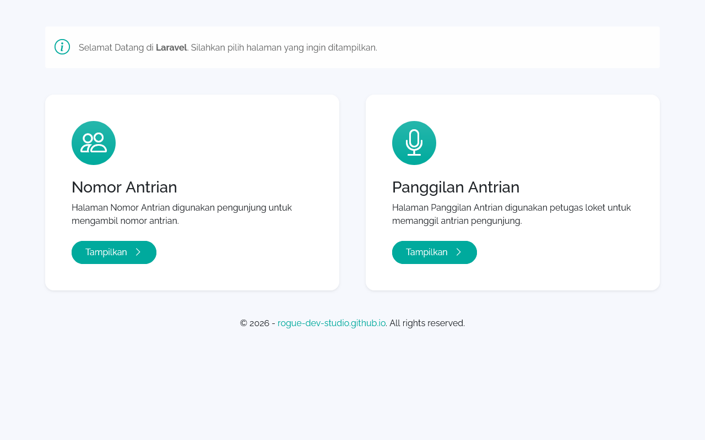
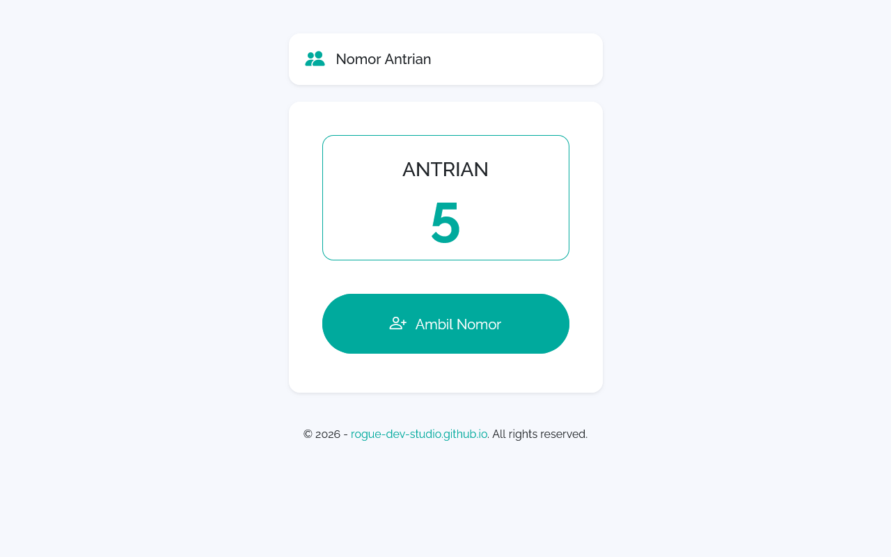
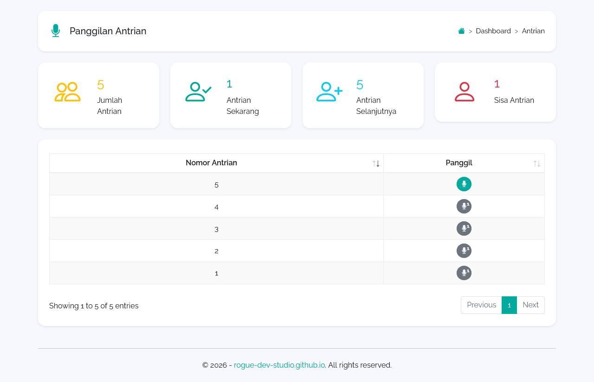
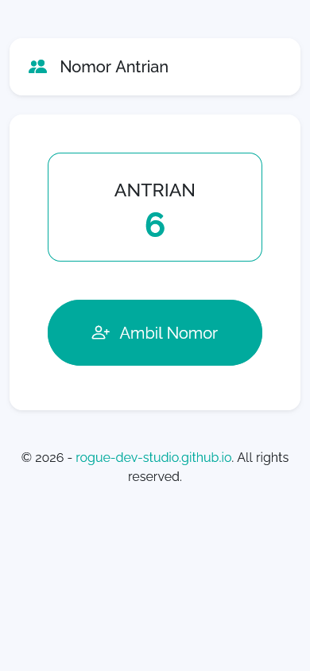

# Sistem Antrian

Aplikasi antrian loket berbasis **Laravel 11** — pengunjung mengambil nomor, petugas memanggil antrian.

Dikembangkan oleh [Rogue Development](https://rogue-dev-studio.github.io/).

## Preview



| Nomor Antrian | Panggilan | Mobile |
|---------------|-----------|--------|
|  |  |  |

## Fitur

- Dashboard pilihan halaman
- Ambil nomor antrian (pengunjung)
- Panggilan antrian + audio (petugas)
- Preview UI di folder `github-contents/`

## Persyaratan

- PHP 8.2+
- Composer
- MySQL (disarankan) atau SQLite + ekstensi PDO terkait
- Extensi PHP: `pdo_mysql` (atau `pdo_sqlite`), `mbstring`, `openssl`, `tokenizer`, `xml`, `ctype`, `json`, `bcmath`

## Instalasi

```bash
git clone https://github.com/rogue-dev-studio/sistem-antrian.git
cd sistem-antrian
composer install
copy .env.example .env
php artisan key:generate
```

### Database (MySQL)

1. Buat database, contoh: `antrian_laravel`
2. Edit `.env`:

```env
APP_NAME="Sistem Antrian"
DB_CONNECTION=mysql
DB_HOST=127.0.0.1
DB_PORT=3306
DB_DATABASE=antrian_laravel
DB_USERNAME=root
DB_PASSWORD=
```

3. Migrasi & jalankan:

```bash
php artisan migrate
php artisan serve
```

Buka: http://127.0.0.1:8000

## Halaman utama

| URL | Fungsi |
|-----|--------|
| `/` | Dashboard |
| `/nomor-antrian` | Ambil nomor |
| `/panggilan-antrian` | Panggil antrian |
| `/antrian` | Alias ke halaman panggilan |

## Lisensi

Kode aplikasi mengikuti lisensi yang tercantum di repositori. Framework Laravel berlisensi [MIT](https://opensource.org/licenses/MIT).
